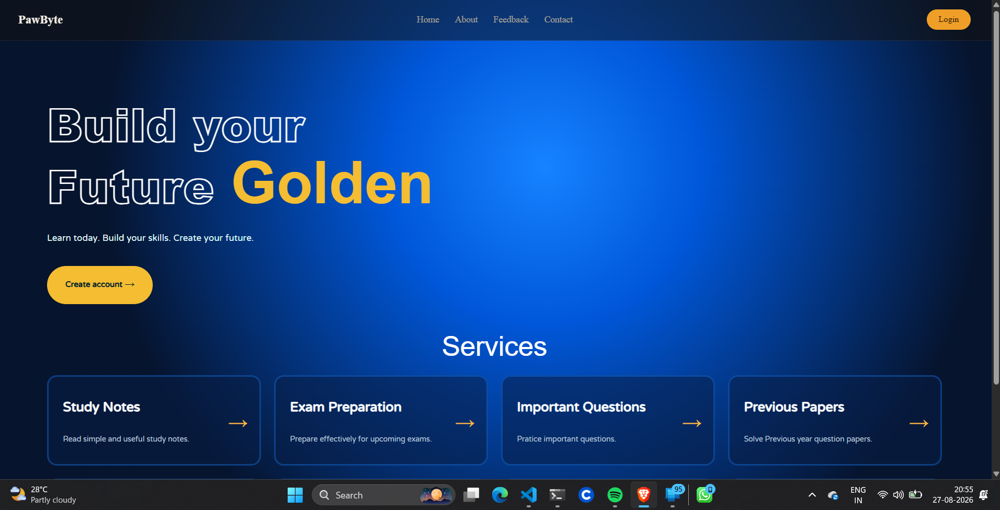
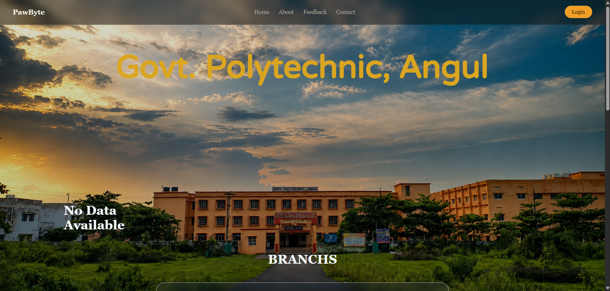
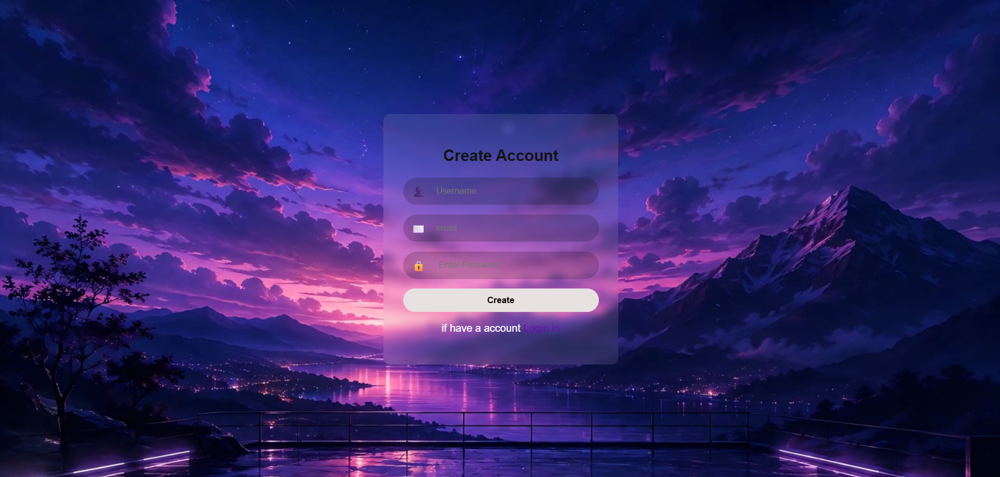

# Campus Connect
## Unified College Portal with AI Study Assistant

5th Semister major project — Diploma in Computer Engineering & IoT, Government Polytechnic Angul.

**Group:** PawBytes

## Idea

A single web portal that replaces scattered offline/manual processes (attendance registers, notice boards, result sheets) with one role-based system for students, faculty, and admin — plus an AI-powered study assistant that generates practice questions and gives instant feedback on answers.

The goal is a project that's genuinely useful day-to-day on campus, buildable by a 5-person team new to frontend development, and includes one standout technical feature (AI integration) without requiring any machine learning background.

## Tech Stack

- **Backend:** Django
- **Frontend:** Django templates + HTML + CSS + JS
- **Database:** PostgreSQL
- **AI:** External LLM API
- **Deployment:** Vercel

## Screenshots

# Home


# About


# Paw AI — Study Assistant


# Login


# Sign Up


## Modules & Team Split (5 people)

| # | Module | Description | Owner |
|---|--------|-------------|-------|
| 1 | **FrontEnd** | Full FrontEnd with UI | CR |
| 2 | **Attendance** | Mark/view attendance, extends existing Student Tracker | TBD |
| 3 | **Documentation** | Post/view announcements, filter by department/year | TBD |
| 4 | **Exams & Results** | Exam schedules, upload/view results (Exam, ExamResult models) | TBD |
| 5 | **BackEnd & AI Study Assistant** | Topic-based question generation + AI answer feedback | TBD |

## Data Models (high level)

**accounts**
- `User` (extend Django's built-in) — role: student / faculty / admin
- `Profile` — department, year, roll number

**attendance**
- `AttendanceRecord` — student, date, subject, status (present/absent)

**notices**
- `Notice` — title, body, posted_by, department, created_at

**exams**
- `Exam` — subject, date, max_marks
- `ExamResult` — student, exam, marks_obtained

**ai_assistant**
- `Question` — topic, text, generated_at
- `Answer` — question, student, answer_text, ai_feedback, score

## AI Study Assistant — How It Works

1. Student picks a topic (e.g. DBMS, OOP, Networking, IoT etc.)
2. Django view calls the AI API with a prompt: *"Generate one interview question about {topic}"*
3. Question is saved to DB and rendered on the page
4. Student submits an answer
5. Django sends the answer back to the AI API asking for feedback/score
6. Feedback is displayed and saved to `Answer` model

## MVP Scope (Mark ✓ If Complete a Task)

**Must-have (MVP):**
- [x] Login/signup with role-based redirect (student/faculty/admin dashboards)
- [ ] Notices board — post (faculty/admin) and view (all)
- [ ] Exam results — admin uploads, student views their own
- [x] AI Study Assistant — pick topic → get question → submit answer → get AI feedback
- [x] Basic responsive UI, consistent theme across all modules

**Nice-to-have (if time permits):**
- [x] AI feedback includes a score out of 10, not just text
- [x] Student dashboard shows AI practice history
- [ ] Notice filtering by department/year

**Explicitly out of scope for this project:**
- Fee payment / financial modules
- Mobile app
- Real-time chat/notifications (WebSockets)
- Any custom-trained ML model

## Repo Structure

Each app has its own **namespaced** templates and static folders (app name repeated inside, e.g. `attendance/templates/attendance/`) so filenames never collide across apps. Shared layout (navbar, footer, global theme) lives once at the project root in `templates/layout.html`, and every app template extends it.

```
Paw-Connect/
├── accounts/
│   ├── templates/
│   │   └── accounts/
│   │       ├── login.html
│   │       └── signup.html
│   ├── static/
│   │   └── accounts/
│   │       └── style.css
│   ├── models.py
│   ├── views.py
│   └── urls.py
│
├── attendance/
│   ├── templates/
│   │   └── attendance/
│   │       ├── mark.html
│   │       └── view.html
│   ├── static/
│   │   └── attendance/
│   │       └── style.css
│   ├── models.py
│   ├── views.py
│   └── urls.py
│
├── notices/
│   ├── templates/
│   │   └── notices/
│   │       └── list.html
│   ├── static/
│   │   └── notices/
│   │       └── style.css
│   ├── models.py
│   ├── views.py
│   └── urls.py
│
├── exams/
│   ├── templates/
│   │   └── exams/
│   │       ├── results.html
│   │       └── schedule.html
│   ├── static/
│   │   └── exams/
│   │       └── style.css
│   ├── models.py
│   ├── views.py
│   └── urls.py
│
├── ai_assistant/
│   ├── templates/
│   │   └── ai_assistant/
│   │       ├── topic_select.html
│   │       └── question.html
│   ├── static/
│   │   └── ai_assistant/
│   │       └── style.css
│   ├── models.py
│   ├── views.py
│   └── urls.py
│
├── templates/                  # project-level, shared across all apps
│   └── layout.html              # navbar, footer, global theme — every app template extends this
│
├── static/                     # project-level, shared across all apps
│   └── css/
│       └── main.css             # global theme: colors, fonts, layout
│
├── Campus_Connect/              # project settings
│   ├── settings.py
│   ├── urls.py                  # includes each app's urls.py
│   └── wsgi.py
├── manage.py
├── requirements.txt
└── README.md
```

**⚠️ Note on `settings.py`:** set `TEMPLATES[0]['DIRS'] = [BASE_DIR / "templates"]` so Django finds the shared `layout.html`, and keep `APP_DIRS: True` so it also finds each app's own namespaced templates.

---

# Contributing to PawConnect

Setup and workflow guide for the PawBytes team.

## 1. Clone the Repo (one-time)

```bash
git clone https://github.com/dp0000000004-eng/Paw-Connect.git
cd Paw-Connect
```

## 2. Set Up Your Environment (one-time)

Create and activate a virtual environment:

```bash
python -m venv venv

# Windows
venv\Scripts\activate

# Mac/Linux/WSL
source venv/bin/activate
```

Install dependencies:

```bash
pip install -r requirements.txt
```

Create a `.env` file in the project root (this is **not** in git — get the actual values from the group):

```
SECRET_KEY=your-django-secret-key
AI_API_KEY=your-ai-api-key
DEBUG=True
```

Run migrations and start the server to confirm everything works:

```bash
python manage.py migrate
python manage.py runserver
```

## 3. Project Structure

Each Django app is self-contained — work inside your own app's folder only. See **Repo Structure** above.

## 4. Branching

Never work directly on `main`. Always branch off it:

```bash
git checkout main
git pull origin main
git checkout -b feature/<module-name>
```

Examples: `feature/notices`, `feature/attendance`, `feature/exams`, `feature/accounts`, `feature/ai-assistant`

## 5. Committing

Commit small and often — not one giant commit at the end.

```bash
git add .
git commit -m "Add Notice model and list view"
```

Write clear, short commit messages describing what changed.

## 6. Pushing & Opening a Pull Request

```bash
git push origin feature/<module-name>
```

Then on GitHub:
1. Open the repo — you'll see a prompt to compare & open a pull request for your branch
2. Base: `main` ← Compare: `feature/<module-name>`
3. Add a short description of what you built
4. Click **Create pull request**

## 7. Review & Merge

- Another teammate reviews the PR before merging — check it runs locally, no conflicts with `main`
- Once approved, click **Merge pull request**
- Delete the branch after merging

## 8. Stay in Sync

Before starting any new work, always pull the latest `main`:

```bash
git checkout main
git pull origin main
```

This avoids painful merge conflicts later.

## Working Rules

- All page templates extend the shared `templates/layout.html` — don't create a separate layout per app
- Keep static/template files namespaced under your app's own folder (e.g. `notices/templates/notices/`, `notices/static/notices/`)
- Stuck for more than ~30 minutes? Ask the group instead of sitting on it
- Never commit `.env`, `venv/`, or `db.sqlite3` — already excluded in `.gitignore`